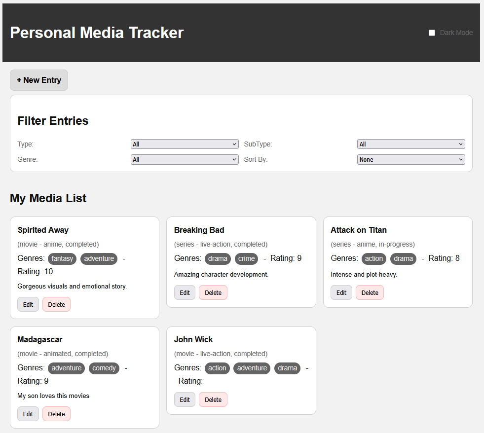
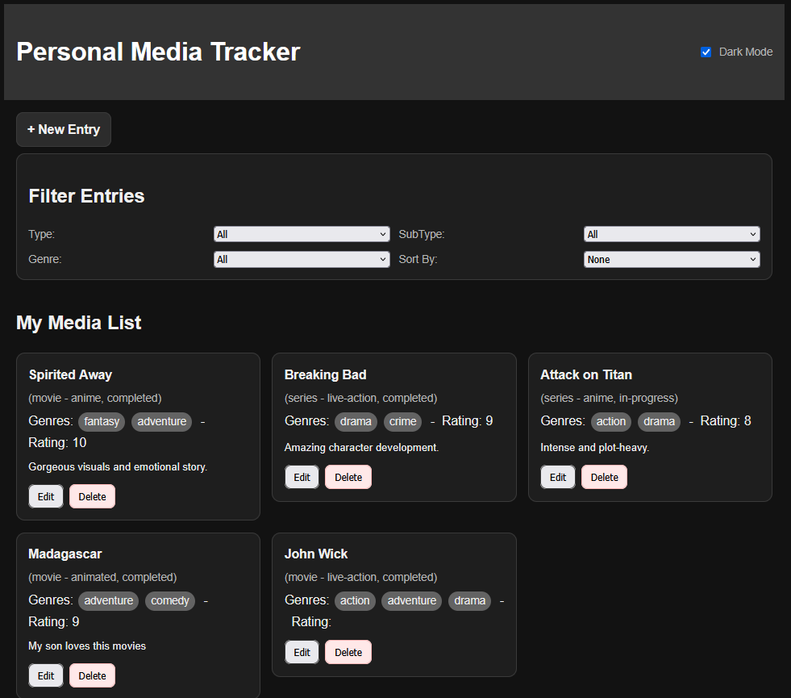
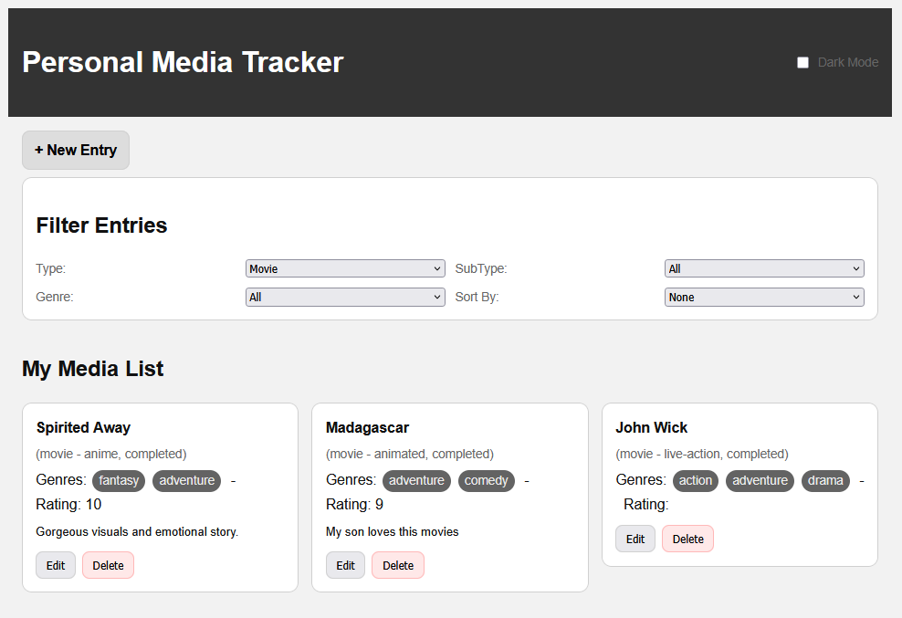
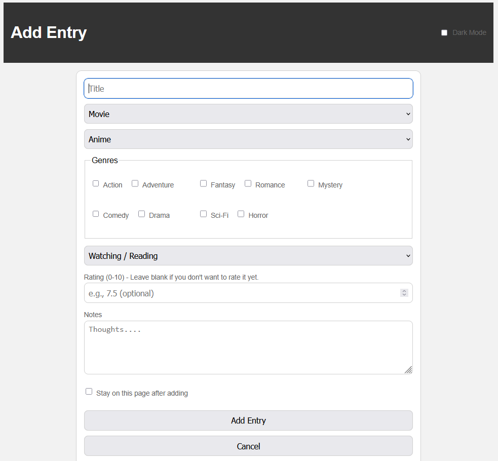

# Personal Media Tracker (V1)

**Live Demo:**
https://bradysteven06.github.io/MediaTrackerWebAppV1/index.html

## Overview

Personal Media Tracker V1 is a lightweight, frontend-only web application for trackering movies, Tv series, anime, and manga.

It allows users to create and manage a personal media list directly in the browser, with data persisting between sessions using 'localStorage'.

This project represents the **initial version** of the Media Tracker before it was later rebuilt as a full-stack application.

## Features

- Add, edit, and delete media entries
- Track type, subtype, genres, status, and rating
- Filter by type, subtype, and genre
- Sort entries by title, rating, or status
- Responsive layout ofr desktop and mobile
- Dark mode with persisted user preference
- Data persistence via browser 'localStorage'

## Tech Stack

- HTML
- CSS
  - CSS variables for theming
  - Responsive layout using modern CSS
- Vanilla JavaScript
- Browser 'localStorage' for persistence

## What I Learned

- Structuring a multi-page web application without a framework
- Managing persistent client-side state with 'localStorage'
- Implementing stable IDs and safe data migration for stored records
- DOM manipulation and event delegation
- Building responsive layouts without external libraries
- Implementing dark mode with persisted user preferences

## Screenshots

## Notes & Limitations

- Data is stored per browser (no backend or cloud sync)
- Clearing browser storage will remove saved entries
- This version is intentionally frontend-only

A full-stack version with an API and database exists separately as **Media Tracker V2**.
